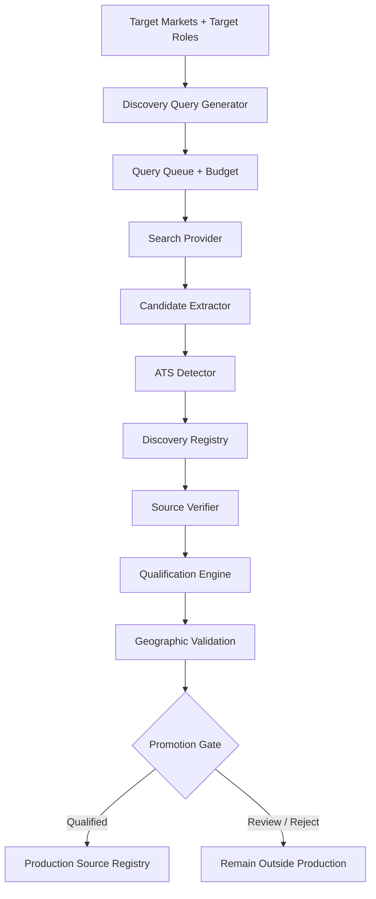
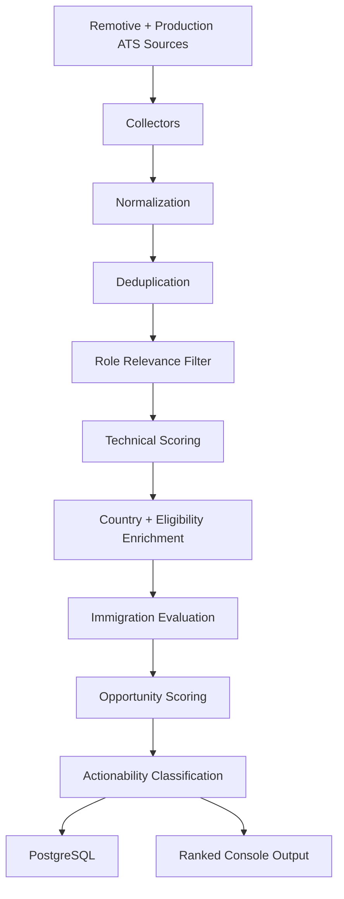

# InfraJob Agent

> Self-hosted job discovery and opportunity intelligence for Linux, infrastructure, systems administration, IT operations, platform, and data-center roles.


InfraJob Agent is a configuration-driven job intelligence platform that does more than collect vacancies.

It discovers new ATS sources on the web, verifies that they are real, checks whether they actually contain target infrastructure roles in relevant markets, promotes qualified sources into the production registry, collects jobs from multiple providers, ranks opportunities, and persists the results in PostgreSQL.

The project is designed for infrastructure-focused international job hunting where a technically relevant vacancy is not automatically a realistic opportunity. Location, target market, language, work authorization signals, sponsorship evidence, immigration constraints, and employer characteristics all matter.

---

## Why This Project Exists

Most job aggregators answer one question:

> “Does this vacancy contain my keywords?”

InfraJob Agent is being built to answer a more useful question:

> “Is this a technically relevant job, in a market I actually target, with enough evidence to justify spending time on it?”

That requires two connected systems:

1. **Source intelligence** — discover and validate new job sources.
2. **Opportunity intelligence** — evaluate the jobs collected from those sources.

The result is a pipeline that can expand its own source coverage instead of relying only on a manually maintained list of companies.

---

## Current Capabilities

### Autonomous source discovery

- Configuration-driven web discovery queries
- Weighted market and role prioritization
- Query cooldown and execution budget
- Search-provider abstraction
- ATS candidate extraction
- ATS detection from public job-board URLs
- Discovery registry with lifecycle states
- Source verification against live ATS endpoints
- Permanent vs transient verification failure handling
- Qualification using live jobs rather than search snippets
- Geographic validation
- Large-board review protection
- Market mismatch detection
- Promotion gate with duplicate protection
- Promotion into the production company-source registry

### Production job collection

- Remotive API
- Greenhouse Job Board API
- Lever postings
- Personio job boards
- Ashby job boards
- Registry-driven company collectors
- Fault isolation between sources
- Unified normalization across ATS providers
- Cross-source deduplication

### Job intelligence

- Target-role taxonomy
- Conditional role matching for broad titles
- Description evidence requirements
- Negative-title exclusions
- Technical relevance scoring
- Opportunity scoring
- Target-market weighting
- Country detection
- Work-authorization signal detection
- Sponsorship and relocation evidence detection
- Language signal detection
- Immigration rule evaluation
- Actionability classification

### Persistence

- PostgreSQL job persistence
- UPSERT-based duplicate prevention
- `first_seen` and `last_seen`
- Application state preservation
- Technical score persistence
- Opportunity score persistence
- Actionability persistence
- Country and immigration metadata persistence

---

## Architecture

InfraJob Agent currently has two cooperating pipelines.

### 1. Source Discovery Pipeline



The discovery layer deliberately separates:

- **discovered** — found by search
- **verified** — ATS source exists and responds
- **qualified** — live jobs prove the source is relevant to a target market
- **promoted** — safe to use as a production source

A valid ATS board is not automatically promoted.

For example, a board may be real but:

- contain no target infrastructure roles,
- only contain roles in the wrong country,
- be a large aggregator,
- have ambiguous geography,
- or have been discovered through a stale search result.

---

### 2. Production Job Intelligence Pipeline



---

## End-to-End Lifecycle

The complete intended lifecycle is:

```text
Web Search
   ↓
Discovery Query
   ↓
ATS Candidate
   ↓
ATS Detection
   ↓
Live Verification
   ↓
Source Qualification
   ↓
Geographic Validation
   ↓
Promotion Gate
   ↓
Production Registry
   ↓
Job Collection
   ↓
Normalization
   ↓
Role Filtering
   ↓
Technical Scoring
   ↓
Opportunity Scoring
   ↓
Actionability
   ↓
PostgreSQL
```

This lifecycle has been validated end-to-end with a source discovered through the discovery subsystem, qualified for Germany, promoted to the production registry, collected by the main pipeline, and used to surface a high-priority Linux/infrastructure opportunity.

---

## Supported Job Sources

| Source | Type | Status |
|---|---|---|
| Remotive | Public API | Supported |
| Greenhouse | ATS | Supported |
| Lever | ATS | Supported |
| Personio | ATS | Supported |
| Ashby | ATS | Supported |

### ATS verification behavior

Verification distinguishes between conditions such as:

- verified source
- verified but currently empty board
- invalid identifier
- access blocked
- rate limited
- upstream error
- timeout
- connection error
- invalid response
- unsupported ATS

Transient failures are not treated the same as permanently invalid sources.

This matters for providers that may intermittently return anti-bot or access-control responses.

---

## Target Markets

Market strategy is defined in `config/target_markets.json`.

Current configured groups include:

### Core

- Germany
- Denmark
- Ireland
- Austria

### Targeted

- Finland
- Netherlands
- Australia

### Bridge / Fast-exit

- United Arab Emirates

### Selective / Low priority

- Canada

### Disabled for active targeting

- United States

Market configuration is separate from geographic recognition. A country can be detected correctly even when it is not an active target market.

---

## Target Role Taxonomy

Role matching is configuration-driven through `config/target_roles.json`.

Current role families include:

- Linux Administrator
- System Administrator
- Infrastructure Engineer
- Systems Engineer
- IT Operations Engineer
- Data Center Engineer
- Virtualization Engineer
- Cloud Operations Engineer
- Platform Operations Engineer
- Network & Security Engineer
- Infrastructure & Cloud Security Engineer
- Platform Engineer
- Site Reliability Engineer
- DevOps Engineer
- Infrastructure DevOps Engineer

Broad roles such as Platform, SRE, DevOps, Systems Engineer, and Cloud Operations can require supporting infrastructure evidence in the description.

This reduces false positives from software-development roles that happen to contain infrastructure terminology.

---

## Role Matching Strategy

InfraJob Agent does not rely on a single keyword search.

A role may be evaluated using:

```text
Title evidence
    +
Description evidence
    +
Negative-title rules
    +
Target-role taxonomy
```

Examples of useful infrastructure evidence include:

- Linux
- Bash
- networking
- monitoring
- VMware
- vCenter
- ESXi
- Docker
- Kubernetes
- AWS
- Azure
- GCP
- infrastructure
- systems administration
- data-center operations

Examples of negative or excluded signals include unrelated:

- software engineering
- frontend development
- data science
- machine learning
- marketing
- sales
- design
- management-only roles

---

## Geographic Resolution

Country detection is used both for job intelligence and source qualification.

The resolver checks geographic evidence in this order:

```text
Explicit country
      ↓
Region / state / province
      ↓
City
      ↓
Unknown
```

This ordering prevents ambiguous city names from producing incorrect countries.

For example:

```text
Melbourne, FL  → United States
Melbourne      → Australia
```

The country alias registry currently covers active target markets and additional countries commonly encountered during source qualification.

Configuration:

```text
config/country_aliases.json
```

---

## Source Qualification

A verified ATS board must pass qualification before it can enter production.

Qualification inspects the **live ATS jobs**, not only the search result that discovered the board.

Possible outcomes include:

```text
qualified
review_large_board
review_market_mismatch
review_unknown_location
reject_no_target_roles
reject_wrong_market
reject_nonproduction_source
not_ready
```

Typical logic:

```text
verified ATS
    ↓
contains target roles?
    ↓
roles located in requested / enabled market?
    ↓
board safe for automatic promotion?
    ↓
qualified
```

Large boards and aggregators are intentionally routed to review rather than automatically promoted.

---

## Promotion Gate

Promotion is deliberately conservative.

A discovery source is eligible only when:

```text
source.status == verified
AND qualification.status == qualified
AND qualification.qualified == true
AND verified_markets is not empty
AND ATS + identifier is not already in production
```

The promotion layer also:

- validates the production registry schema before writing,
- prevents duplicate `ATS + identifier` entries,
- records promotion metadata in the discovery registry,
- updates the discovery source state to `promoted`,
- derives production markets from verified live-job geography rather than the original search query.

Configuration:

```text
config/source_promotion.json
```

---

## Technical Score

The technical score measures role relevance and infrastructure fit.

It uses weighted evidence from:

- job title
- target-role match
- Linux / systems signals
- networking
- monitoring
- virtualization
- cloud platforms
- containers
- infrastructure tooling
- negative role penalties

A technically excellent job can still be a poor opportunity if it is in a disabled market or has incompatible constraints.

That is why technical scoring is separate from opportunity scoring.

---

## Opportunity Score

The Opportunity Score evaluates whether a technically relevant job is worth prioritizing.

Signals can include:

- target-market weight
- country
- immigration assessment
- work-authorization language
- sponsorship evidence
- relocation evidence
- language requirements
- technical score
- market strategy

This produces a second layer of ranking after technical relevance.

---

## Actionability

Qualified jobs are mapped into practical decision categories.

Current actionability states include:

```text
HIGH_PRIORITY
REVIEW
LOW_PRIORITY
NOT_TARGETED
BLOCKED
UNCLASSIFIED
```

Examples:

- **HIGH_PRIORITY** — strong opportunity score in an active market
- **REVIEW** — potentially useful, but requires human verification
- **LOW_PRIORITY** — relevant but strategically weak
- **NOT_TARGETED** — relevant role outside current targeting strategy
- **BLOCKED** — explicit hard blocker detected

The purpose is not merely to rank jobs. It is to reduce the amount of human attention wasted on low-value opportunities.

---

## Immigration Intelligence

Country-specific immigration rules are configuration-driven.

The current system can evaluate structured rule data and return assessments such as:

```text
eligible
needs_verification
market_disabled
country_unknown
rules_not_configured
```

Possible checks include:

- work authorization restrictions
- occupation requirements
- salary thresholds
- employer sponsorship
- country-specific pathways

Immigration logic is an opportunity-analysis signal, not legal advice. Rules can change and should always be verified against current official sources before making immigration decisions.

---

## Language Detection

Language signals can be extracted from job descriptions to distinguish between:

- explicit English requirements,
- local-language requirements,
- preferred language,
- unknown language requirements.

Language evidence feeds opportunity analysis rather than technical relevance.

---

## PostgreSQL Persistence

Qualified jobs are stored in PostgreSQL using source-aware external identifiers.

Example:

```text
greenhouse:<job_id>
lever:<site>:<job_id>
personio:<job_id>
ashby:<board>:<job_id>
```

UPSERT behavior:

```text
new external_id
      ↓
    INSERT
```

```text
existing external_id
      ↓
    UPDATE
      ↓
refresh job data
refresh scores
update last_seen
preserve application status
```

This prevents duplicate job records while retaining application workflow state.

---

## Application Lifecycle

Persisted jobs can move through application states such as:

```text
new
 ↓
reviewing
 ↓
approved
 ↓
applied
 ↓
interview
```

Alternative outcomes:

```text
rejected
archived
```

Rediscovering a job does not reset its application status.

---

## Discovery Query System

Discovery queries are generated from:

- enabled target markets,
- role priorities,
- ATS priorities,
- per-market query limits.

The queue adds:

- weighted scheduling,
- cooldown windows,
- execution budget,
- retry handling,
- persisted runtime state.

This prevents every run from repeatedly firing the same search queries.

Relevant configuration:

```text
config/discovery_search.json
config/discovery_runtime.json
runtime/discovery_query_state.json
```

---

## Project Structure

```text
infrajob-agent/
│
├── app/
│   ├── collectors/
│   │   ├── remotive.py
│   │   ├── greenhouse.py
│   │   ├── personio.py
│   │   ├── lever.py
│   │   └── ashby.py
│   │
│   ├── actionability.py
│   ├── ats_detector.py
│   ├── candidate_extractor.py
│   ├── config_loader.py
│   ├── country_detector.py
│   ├── database.py
│   ├── discovery_query_generator.py
│   ├── discovery_queue.py
│   ├── discovery_registry.py
│   ├── discovery_runner.py
│   ├── discovery_workflow.py
│   ├── eligibility_detector.py
│   ├── immigration_evaluator.py
│   ├── immigration_rules.py
│   ├── job_enricher.py
│   ├── job_filter.py
│   ├── job_scorer.py
│   ├── job_utils.py
│   ├── language_detector.py
│   ├── logger.py
│   ├── normalizers.py
│   ├── opportunity_scorer.py
│   ├── qualification_workflow.py
│   ├── search_provider.py
│   ├── source_promotion.py
│   ├── source_qualifier.py
│   ├── source_registry.py
│   └── source_verifier.py
│
├── config/
│   ├── actionability.json
│   ├── company_sources.json
│   ├── country_aliases.json
│   ├── discovered_sources.json
│   ├── discovery_runtime.json
│   ├── discovery_search.json
│   ├── immigration_rules.json
│   ├── opportunity_scoring.json
│   ├── source_promotion.json
│   ├── source_qualification.json
│   ├── sources.json
│   ├── target_markets.json
│   └── target_roles.json
│
├── logs/
├── runtime/
├── tests/
│
├── .env.example
├── .gitignore
├── main.py
├── README.md
└── requirements.txt
```

---

## Configuration Overview

| File | Purpose |
|---|---|
| `config/sources.json` | General source/search configuration |
| `config/company_sources.json` | Production ATS source registry |
| `config/discovered_sources.json` | Discovery lifecycle registry |
| `config/target_markets.json` | Market strategy and weights |
| `config/target_roles.json` | Role taxonomy and evidence rules |
| `config/country_aliases.json` | Geographic recognition |
| `config/immigration_rules.json` | Immigration rule definitions |
| `config/opportunity_scoring.json` | Opportunity scoring rules |
| `config/actionability.json` | Actionability thresholds |
| `config/discovery_search.json` | Discovery query generation |
| `config/discovery_runtime.json` | Query budget, cooldowns, provider settings |
| `config/source_qualification.json` | Source qualification thresholds |
| `config/source_promotion.json` | Promotion policy |

---

## Requirements

Current development environment:

- Python 3.13
- PostgreSQL
- Linux
- `requests`
- `python-dotenv`
- `psycopg2-binary`
- `ddgs`

Install Python dependencies with:

```bash
pip install -r requirements.txt
```

---

## Quick Start

### 1. Clone the repository

```bash
git clone https://github.com/alirezaazimian/infrajob-agent.git
cd infrajob-agent
```

### 2. Create a virtual environment

```bash
python -m venv .venv
source .venv/bin/activate
```

### 3. Install dependencies

```bash
pip install -r requirements.txt
```

### 4. Configure environment variables

Copy the example environment file:

```bash
cp .env.example .env
```

Then configure the local PostgreSQL connection values required by the project.

Do not commit `.env`.

### 5. Prepare PostgreSQL

Create the project database and user according to your local environment, then ensure the credentials match `.env`.

The application initializes and updates its persistence layer through the project database code.

### 6. Run the production job pipeline

```bash
python main.py
```

### 7. Run source discovery

Example:

```bash
python -m app.discovery_runner --limit 6
```

Discovery execution is budgeted and cooldown-aware, so repeated runs do not blindly repeat the same queries.

---

## Example Pipeline Output

A normal production run reports source collection followed by ranked opportunities:

```text
Company sources: 9 enabled / 9 total
Remotive jobs: ...
Greenhouse jobs: ...
Personio jobs: ...
Lever jobs: ...
Ashby jobs: ...

Total jobs: ...
Unique jobs: ...
Relevant jobs: ...
Qualified jobs: ...
```

A ranked opportunity contains information such as:

```text
Title
Company
Location
Country
Source
Technical Score
Opportunity Score
Actionability
Market Group
Immigration Assessment
Language
Sponsorship Evidence
Relocation Evidence
Matched Skills
```

---

## Reliability Design

The project is intentionally defensive around external services.

Collectors isolate failures so one broken source does not terminate the complete run.

The system handles or classifies:

- HTTP errors
- timeouts
- connection failures
- invalid ATS identifiers
- transient access blocks
- rate limits
- malformed responses
- empty but valid boards

Discovery and production registries are also kept separate so an untrusted discovered source cannot immediately affect the production collector set.

---

## Security

- Secrets belong in `.env`.
- `.env` should remain excluded from Git.
- Public configuration should not contain credentials.
- Source promotion validates registry structure before writing.
- External ATS content is treated as untrusted input.
- Automatic application submission is not currently enabled.

---

## Current Development Status

The following major capabilities are operational:

- [x] Multi-source collection
- [x] PostgreSQL persistence
- [x] UPSERT and application-state preservation
- [x] Target-market configuration
- [x] Target-role taxonomy
- [x] Country detection
- [x] Work-authorization signal detection
- [x] Sponsorship and relocation evidence
- [x] Language detection
- [x] Immigration evaluation
- [x] Opportunity scoring
- [x] Actionability classification
- [x] Registry-driven ATS collection
- [x] Automated source discovery
- [x] ATS detection
- [x] Source verification
- [x] Discovery query scheduling
- [x] Candidate extraction
- [x] Source qualification
- [x] Geographic resolution hardening
- [x] Qualification persistence
- [x] Promotion gate
- [x] Production registry promotion

---

## Roadmap

Planned work includes:

### Source intelligence

- stronger company/board identity validation
- richer geography handling
- better aggregator detection
- source-health history
- stale-source retirement
- scheduled discovery runs
- discovery metrics and reporting

### Opportunity intelligence

- richer salary extraction
- stronger language classification
- employer sponsorship history
- evidence confidence scoring
- freshness-aware ranking
- configurable profile-to-job matching

### Application workflow

- application material generation
- CV tailoring
- cover-letter generation
- review-before-send workflow
- application history
- interview tracking

### Automation

- scheduled recurring discovery
- notification workflows
- human-approved application actions
- optional agent orchestration

Automatic application submission is intentionally a later-stage feature and should remain review-gated.

---

## Design Principles

InfraJob Agent follows several principles:

1. **Configuration over hard-coding**  
   Markets, roles, scoring, discovery behavior, and promotion policy should be configurable.

2. **Live evidence over search snippets**  
   Search results discover candidates. Live ATS data determines whether they are useful.

3. **Technical relevance is not opportunity quality**  
   A technically perfect role can still be strategically unusable.

4. **Review ambiguous evidence**  
   Unknown geography and oversized boards should not silently enter production.

5. **External failures must be isolated**  
   One provider failure should not take down the full pipeline.

6. **Human attention is the scarce resource**  
   The system should reduce low-value review work, not generate more of it.

---

## Project Direction

InfraJob Agent is evolving from a job collector into a self-expanding infrastructure job intelligence system.

The longer-term goal is a platform capable of:

```text
Discover Sources
      ↓
Discover Jobs
      ↓
Understand Relevance
      ↓
Understand Geography
      ↓
Evaluate Opportunity
      ↓
Prioritize Human Attention
      ↓
Track Applications
      ↓
Assist With Carefully Gated Automation
```

The project remains under active development, but its core discovery, qualification, promotion, scoring, and persistence layers are operational.

---

## Repository

GitHub:

```text
https://github.com/alirezaazimian/infrajob-agent
```

---

## Disclaimer

Job-market and immigration information can change over time.

InfraJob Agent is an engineering project for opportunity analysis and workflow support. Immigration assessments produced by the system are informational signals and must not be treated as legal advice or a substitute for current official government guidance.
